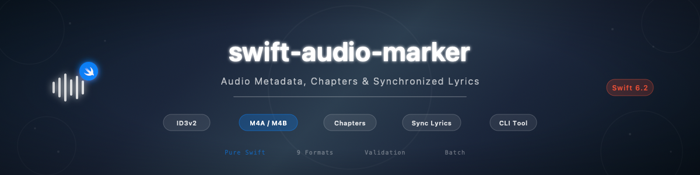

# podcast-feed-maker

[](https://github.com/atelier-socle/podcast-feed-maker/actions/workflows/ci.yml)
[](https://codecov.io/github/atelier-socle/podcast-feed-maker)
[](https://swift.org)
[]()
[](https://atelier-socle.github.io/podcast-feed-maker/documentation/podcastfeedmaker/)



Reference-quality Swift library for generating, parsing, and validating podcast RSS feeds. PodcastFeedMaker is fully bi-directional: build feeds from Swift models and generate standards-compliant XML, or parse existing XML back into the same strongly-typed model. It covers all seven XML namespaces used in podcasting — RSS 2.0, iTunes, Podcast Namespace 2.0 (all 32 tags), Atom, Dublin Core, Content Module, and Podlove Simple Chapters — with multi-platform validation for Apple Podcasts, Spotify, Amazon Music, Podcast Index, and PSP-1. Import and export OPML subscription lists with validation and bidirectional feed conversion. Audit feed quality with a weighted scoring engine that produces actionable recommendations and a cross-platform compatibility matrix. Zero third-party dependencies in the core library, pure Swift + Foundation, Linux-compatible from day one. Suitable for podcast hosting platforms, feed migration tools, podcast apps, and server-side Swift.

Part of the [Atelier Socle](https://www.atelier-socle.com) ecosystem.

---

## Features

- **Generate** — Synchronous and streaming XML generation with configurable formatting, 4 namespace modes, automatic CDATA wrapping, and XML escaping
- **Parse** — Full-fidelity XML parsing with diagnostics, 12 date formats (RFC 2822, ISO 8601, fuzzy), best-effort error recovery, and streaming item parsing
- **Validate** — 5 platform validators (Apple Podcasts, Spotify, Amazon Music, Podcast Index, PSP-1) with 3 severity levels and cross-cutting rules (GUID uniqueness, HTTPS enforcement, enclosure checks)
- **Round-trip** — Parse, modify, and regenerate with zero data loss: unknown elements, CDATA sections, XML comments, and namespace prefixes are all preserved
- **Builder DSL** — Result builder syntax with 18 channel and 14 item fluent modifiers, enclosure factories (`.mp3`, `.m4a`, `.mp4`), and a PSP-1 compliance helper
- **Templates** — 4 expertise levels (basic, standard, advanced, expert), platform presets, 58-case FeedTag enum, and composable templates via `+` operator and fluent builder
- **Chapters** — JSON Chapters (Podcast NS 2.0) and Podlove Simple Chapters (PSC), both Codable, supporting inline and linked formats
- **Feed diff** — Compare two feeds and detect added, removed, and modified episodes, channel changes, and namespace differences
- **OPML** — Import and export podcast subscription lists (OPML 1.0 and 2.0) with validation and feed conversion
- **Audit** — Quality scoring (0-100) with 5 weighted categories, actionable recommendations, and cross-platform compatibility matrix
- **CLI** — 13 commands: `init`, `generate`, `read`, `validate`, `lint`, `episodes`, `chapters`, `diff`, `convert`, `add-episode`, `opml-export`, `opml-import`, `audit`
- **Strict concurrency** — All public types are `Sendable`, built with Swift 6.2 strict concurrency throughout

---

## Installation

### Requirements

- **Swift 6.2+** with strict concurrency
- **Library platforms**: macOS 13+, iOS 16+, tvOS 16+, watchOS 9+, visionOS 1+, Mac Catalyst 16+
- **CLI platforms**: macOS 13+, Linux (Ubuntu 22.04+, Amazon Linux 2023+)
- **Zero third-party dependencies** in the core library (`swift-argument-parser` for CLI only)

### Swift Package Manager

Add the dependency to your `Package.swift`:

```swift
dependencies: [
    .package(url: "https://github.com/atelier-socle/podcast-feed-maker.git", from: "0.1.0")
]
```

Then add it to your target:

```swift
.target(
    name: "YourTarget",
    dependencies: ["PodcastFeedMaker"]
)
```

---

## Quick Start

```swift
import PodcastFeedMaker

// 1. Build a feed with the result builder DSL
let feed = PodcastFeed {
    Channel(
        title: "My Podcast",
        link: URL(string: "https://example.com")!,
        description: "A show about technology"
    )
    .author("Jane Host")
    .explicit(false)
    .category(.technology)
    .image("https://cdn.example.com/artwork.jpg")
    .locked(owner: "jane@example.com")
    .guid("aaaaaaaa-bbbb-cccc-dddd-eeeeeeeeeeee")

    Item(
        title: "Episode 1",
        enclosure: Enclosure.mp3(
            url: "https://cdn.example.com/episodes/ep001.mp3",
            length: 48_000_000
        )
    )
    .guid("ep-001", isPermaLink: false)
    .description("The pilot episode")
    .duration(1800)
}

// 2. Generate XML
let xml = try FeedGenerator().generate(feed)

// 3. Parse it back
let parsed = try FeedParser().parse(xml)

// 4. Validate against Apple Podcasts
let report = FeedValidator().validate(parsed, for: .apple)
print("Valid: \(report.isValid)")  // errors, warnings, infos
```

---

## Namespace Coverage

PodcastFeedMaker covers all seven XML namespaces used in podcasting. Every tag and attribute is modeled, generated, parsed, and validated.

| # | Namespace | Prefix | URI | Tags |
|---|-----------|--------|-----|------|
| 1 | RSS 2.0 Core | — | — | 14 (channel + item) |
| 2 | iTunes | `itunes` | `http://www.itunes.com/dtds/podcast-1.0.dtd` | 10 |
| 3 | Podcast NS 2.0 | `podcast` | `https://podcastindex.org/namespace/1.0` | 32 |
| 4 | Atom | `atom` | `http://www.w3.org/2005/Atom` | 1 |
| 5 | Dublin Core | `dc` | `http://purl.org/dc/elements/1.1/` | 1 |
| 6 | Content Module | `content` | `http://purl.org/rss/1.0/modules/content/` | 1 |
| 7 | Podlove Simple Chapters | `psc` | `http://podlove.org/simple-chapters` | 1 |

### Podcast Namespace 2.0 — All 32 Tags

| Phase | Tags |
|-------|------|
| Phase 1 (5) | `locked`, `transcript`, `funding`, `chapters`, `soundbite` |
| Phase 2 (4) | `person`, `location`, `season`, `episode` |
| Phase 3 (5) | `trailer`, `license`, `alternateEnclosure`, `source`, `integrity` |
| Phase 4+ (18) | `guid`, `value`, `medium`, `liveItem`, `contentLink`, `socialInteract`, `block`, `txt`, `remoteItem`, `podroll`, `updateFrequency`, `podping`, `valueTimeSplit`, `chat`, `publisher`, `image`, `images`, `valueRecipient` |

---

## Platform Compatibility

PodcastFeedMaker generates feeds compatible with all major podcast distribution platforms. Five platforms have dedicated validation rule sets (marked with ✅ in the Validator column); the others consume standard RSS 2.0 + iTunes feeds without issues.

| Platform | RSS 2.0 | iTunes | Podcast NS | Atom | Validator | Spec |
|----------|---------|--------|------------|------|-----------|------|
| Apple Podcasts | ✅ | ✅ | ✅ Partial | ✅ | ✅ | [Requirements](https://podcasters.apple.com/support/823-podcast-requirements) |
| Spotify | ✅ | ✅ | ✅ Partial | — | ✅ | [RSS Guide](https://podcasters.spotify.com/help/article/rss-feed-requirements) |
| Amazon Music | ✅ | ✅ Partial | — | — | ✅ | [Podcasts](https://music.amazon.com/podcasts) |
| Podcast Index | ✅ | ✅ | ✅ Full | ✅ | ✅ | [Namespace](https://github.com/Podcastindex-org/podcast-namespace/blob/main/docs/1.0.md) |
| PSP-1 Standard | ✅ | ✅ | ✅ Required | ✅ | ✅ | [PSP-1 Spec](https://github.com/Podcast-Standards-Project/PSP-1-Podcast-RSS-Specification) |
| Pocket Casts | ✅ | ✅ | ✅ Partial | ✅ | — | [Submit](https://www.pocketcasts.com/submit/) |
| Deezer | ✅ | ✅ | — | — | — | [Spec](https://support.deezer.com/hc/en-gb/articles/4409286935697) |
| Google Podcasts | ✅ | ✅ Partial | — | ✅ | — | ⚠️ [Retired](https://support.google.com/podcast-publishers/answer/9471433) |

---

## Key Concepts

### Building Feeds

The result builder DSL and fluent modifiers let you construct feeds declaratively. Chain modifiers on `Channel` and `Item`:

```swift
let feed = PodcastFeed {
    Channel(title: "Show", link: url, description: "About")
        .author("Host").explicit(false).category(.technology)

    Item(title: "Ep 1", enclosure: Enclosure.mp3(url: "https://cdn.example.com/ep1.mp3", length: 48_000_000))
        .duration(1800).episode(1).season(1)
}
```

#### Channel Modifiers (18)

| Modifier | Sets |
|----------|------|
| `.author(_:)` | `itunesAuthor` |
| `.language(_:)` | `language` |
| `.copyright(_:)` | `copyright` |
| `.category(_:)` | `itunesCategories` (append) |
| `.categories(_:)` | `itunesCategories` (replace) |
| `.explicit(_:)` | `itunesExplicit` |
| `.image(_:)` | `itunesImage` |
| `.type(_:)` | `itunesType` |
| `.owner(name:email:)` | `itunesOwner` |
| `.locked(owner:)` | `locked` |
| `.guid(_:)` | `podcastGuid` |
| `.funding(url:text:)` | `funding` (append) |
| `.atomLink(href:rel:)` | `atomLinks` (append) |
| `.medium(_:)` | `medium` |
| `.publisher(feedGuid:feedUrl:)` | `publisher` |
| `.newFeedUrl(_:)` | `itunesNewFeedUrl` |
| `.complete(_:)` | `itunesComplete` |
| `.location(name:geo:osm:)` | `locations` (append) |

#### Item Modifiers (14)

| Modifier | Sets |
|----------|------|
| `.description(_:)` | `description` |
| `.guid(_:isPermaLink:)` | `guid` |
| `.pubDate(_:)` | `pubDate` |
| `.duration(_:)` | `itunesDuration` |
| `.explicit(_:)` | `itunesExplicit` |
| `.image(_:)` | `itunesImage` |
| `.season(_:)` | `itunesSeason` |
| `.episode(_:)` | `itunesEpisode` |
| `.episodeType(_:)` | `itunesEpisodeType` |
| `.person(_:role:)` | `persons` (append) |
| `.transcript(url:type:)` | `transcripts` (append) |
| `.chapters(url:)` | `chaptersLink` |
| `.soundbite(start:duration:title:)` | `soundbites` (append) |
| `.contentEncoded(_:)` | `contentEncoded` |

#### Enclosure Factories

Three static factory methods on `Enclosure` set the MIME type automatically:

| Factory | MIME Type |
|---------|-----------|
| `.mp3(url:length:)` | `audio/mpeg` |
| `.m4a(url:length:)` | `audio/x-m4a` |
| `.mp4(url:length:)` | `video/mp4` |

### Generating XML

`FeedGenerator` produces complete RSS XML synchronously. `StreamingFeedGenerator` yields async chunks (N+2 for N items) for large catalogs:

```swift
let xml = try FeedGenerator(prettyPrint: true, namespaceMode: .auto).generate(feed)
```

#### Namespace Modes

| Mode | Behavior |
|------|----------|
| `.auto` | Scans the feed and declares only namespaces that are actually used |
| `.feedDefined` | Declares exactly the namespaces listed in `PodcastFeed.namespaces` |
| `.explicit(Set)` | Declares a caller-specified set of namespaces |
| `.parsed` | Uses the original prefixes and URIs from a parsed feed (round-trip mode) |

### Parsing Feeds

`FeedParser` handles all 7 namespaces with best-effort error recovery. Use `parseWithDiagnostics` to access warnings alongside the parsed feed:

```swift
let result = try FeedParser().parseWithDiagnostics(xmlString)
let feed = result.feed
let warnings = result.warnings
```

#### Supported Date Formats (12)

| Category | Formats |
|----------|---------|
| RFC 2822 | `EEE, dd MMM yyyy HH:mm:ss Z`, `dd MMM yyyy HH:mm:ss Z`, with/without timezone name |
| ISO 8601 | `yyyy-MM-dd'T'HH:mm:ssZ`, `yyyy-MM-dd'T'HH:mm:ss.SSSZ`, `yyyy-MM-dd` |
| Fuzzy | `MMM dd, yyyy`, `yyyy/MM/dd`, `MM/dd/yyyy`, `dd-MM-yyyy`, `yyyy.MM.dd` |

### Validating

`FeedValidator` checks feeds against 5 platforms with error, warning, and info severity levels:

```swift
let reports = FeedValidator().validateAll(feed)
for report in reports {
    print("\(report.platform): \(report.isValid ? "pass" : "fail") — \(report.errors.count) errors")
}
```

#### Platform Requirements

| Platform | Key Requirements |
|----------|-----------------|
| Apple Podcasts | HTTPS required, artwork 1400-3000px JPEG/PNG, `itunes:image` + `itunes:category` + `itunes:explicit` required |
| Spotify | MP3 preferred, max 200 MB file size, artwork 1400-2048px square, max 4000-byte description |
| Amazon Music | Broadest format support (MP3/M4A/FLAC/OGG/ALAC), artwork 1400-3000px |
| Podcast Index | Podcast NS 2.0 tags (`podcast:locked`, `podcast:guid`, `podcast:funding`), V4V config |
| PSP-1 | `language` required, `atom:link` self required, `podcast:locked` + `podcast:guid` required, GUID on every item |

### Templates

Four built-in templates scaffold feeds at different expertise levels. Factory methods create pre-configured feeds:

```swift
let feed = PodcastFeed.standard(
    title: "My Show",
    link: URL(string: "https://example.com")!,
    description: "About the show"
) { channel in
    channel.author("Host").explicit(false).category(.technology)
        .owner(name: "Host", email: "host@example.com")
        .locked(owner: "host@example.com").guid("aaaa-bbbb-cccc")
}
```

#### Expertise Levels

| Level | Scope | Target |
|-------|-------|--------|
| Basic | RSS 2.0 + minimal iTunes | Quick prototyping, Apple + Spotify minimum |
| Standard | + PSP-1 compliance | Production feeds, full platform compatibility |
| Advanced | + Podcast NS 2.0 phases 1-3 | Transcripts, chapters, persons, V4V |
| Expert | Full 7-namespace coverage | Complete ecosystem participation |

Templates are composable via the `+` operator and fluent builder methods (`.requiring()`, `.recommending()`, `.targeting()`, `.named()`).

### Round-Trip and Diff

Parse an existing feed, modify it, and regenerate with zero data loss. Four features preserve fidelity:

| Feature | What It Preserves |
|---------|-------------------|
| Unknown elements | Non-modeled XML elements captured as `UnknownElement` |
| CDATA tracking | Tracks which fields used CDATA in the original XML |
| XML comments | Preserves `<!-- comments -->` at channel and item level |
| Namespace prefixes | Retains original prefix-to-URI mappings from parsed feeds |

Compare feeds with `FeedDiff`:

```swift
let diffs = FeedDiff().diff(originalFeed, modifiedFeed)
for diff in diffs {
    print("\(diff.changeType): \(diff.field)")
}
```

### OPML Subscription Lists

Import and export podcast subscription lists in OPML format. Supports OPML 1.0 and 2.0 with full round-trip fidelity, including custom attributes:

```swift
import PodcastFeedMaker

// Parse an OPML file
let opml = try OPMLParser().parse(opmlString)
print("Subscriptions: \(opml.podcastFeeds.count)")

// List all podcast feeds (depth-first across nested categories)
for feed in opml.podcastFeeds {
    print("\(feed.text) — \(feed.xmlUrl?.absoluteString ?? "")")
}

// Export feeds to OPML
let document = OPMLFeedConverter.document(
    from: feeds,
    title: "My Podcasts",
    ownerName: "Jane Doe"
)
let xml = OPMLGenerator().generate(document)

// Validate OPML
let report = OPMLValidator().validate(document)
print("Valid: \(report.isValid)")
```

### Feed Auditing

Score your feed's quality from 0 to 100 across five weighted categories, with actionable recommendations and a cross-platform compatibility matrix:

```swift
import PodcastFeedMaker

let feed = try FeedParser().parse(xmlString)
let auditor = FeedAuditor()
let report = auditor.audit(feed)

print("Score: \(report.score)/100 (\(report.grade.rawValue))")

for category in report.categoryScores {
    print("\(category.category.displayName): \(category.earned)/\(category.maximum)")
}

for rec in report.recommendations where rec.priority == .critical {
    print("\(rec.message)")
}

// Platform compatibility
for result in report.compatibility {
    print("\(result.platform): \(result.status)")
}

// Compare two versions
let evolution = auditor.compare(before: oldFeed, after: newFeed)
print("Score: \(evolution.beforeScore) -> \(evolution.afterScore)")
```

### Chapters

Two chapter systems are supported: JSON Chapters (linked via `podcast:chapters`) and Podlove Simple Chapters (inline `psc:chapters`). Both are fully Codable:

```swift
let chapters = JSONChapterList(chapters: [
    JSONChapter(startTime: 0, title: "Intro"),
    JSONChapter(startTime: 300, title: "Main Topic"),
])
let json = try JSONEncoder().encode(chapters)
```

---

## Architecture

```
Sources/
    PodcastFeedMaker/              # Core library (zero external deps, Linux-compatible)
        Model/                      # PodcastFeed, Channel, Item, 57 types across 7 namespaces
        Generator/                  # FeedGenerator, StreamingFeedGenerator, XMLBuilder
        Parser/                     # FeedParser, StreamingFeedParser, DateParser
        Validator/                  # FeedValidator, 5 platform rule sets
        Builders/                   # PodcastFeedBuilder, fluent modifiers, PSP-1 helper
        Templates/                  # FeedTemplate, 4 levels, composition, FeedTag
        Engine/                     # PodcastFeedEngine facade, FeedDiff, NetworkValidator
        OPML/                       # OPML import/export, validation, feed conversion
        Audit/                      # Feed quality scoring, recommendations, compatibility
        Documentation.docc/         # 12 DocC articles
    PodcastFeedCommands/            # CLI implementations (depends on ArgumentParser)
    PodcastFeedCLI/                 # Executable entry point (@main)
Tests/
    PodcastFeedMakerTests/          # 2600+ tests across 270+ suites
        Fixtures/                   # 9 real podcast feed XML files
    PodcastFeedCommandsTests/       # CLI command tests
```

---

## CLI

### Installation

```bash
swift build -c release
cp .build/release/podcastfeed /usr/local/bin/
```

### Usage

```bash
# Scaffold a new feed
podcastfeed init --template standard --format xml --output feed.xml

# Validate against Apple Podcasts
podcastfeed validate feed.xml --platform apple

# Quick lint against all platforms
podcastfeed lint feed.xml --strict

# Compare two feeds
podcastfeed diff feed-v1.xml feed-v2.xml

# List episodes sorted by date
podcastfeed episodes feed.xml --sort date --limit 10

# Add an episode
podcastfeed add-episode feed.xml --title "New Episode" --audio https://example.com/ep.mp3 --output updated.xml

# Export feeds to OPML
podcastfeed opml-export feed1.xml feed2.xml -o subscriptions.opml --title "My Podcasts"

# Import and list feeds from OPML
podcastfeed opml-import subscriptions.opml
podcastfeed opml-import subscriptions.opml -f json
podcastfeed opml-import subscriptions.opml --validate

# Audit feed quality
podcastfeed audit feed.xml
podcastfeed audit feed.xml --format json
podcastfeed audit feed.xml --min-score 80
podcastfeed audit feed.xml --compare feed-v2.xml
```

### Commands

| Command | Description |
|---------|-------------|
| `init` | Scaffold a new feed from a template (basic, standard, advanced, expert) |
| `generate` | Generate RSS XML from a JSON feed definition |
| `read` | Parse and display a podcast feed (summary, JSON, or XML) |
| `validate` | Validate against platform requirements (apple, spotify, amazon, podcastIndex, psp1) |
| `lint` | Quick feed validation with optional strict mode and template checking |
| `episodes` | List episodes with sorting and limiting |
| `chapters` | Extract chapter information (text, JSON, or PSC format) |
| `diff` | Compare two podcast feeds and show differences |
| `convert` | Convert between feed formats (XML, JSON, PSC) |
| `add-episode` | Add a new episode to an existing feed |
| `opml-export` | Export one or more feeds as an OPML subscription list |
| `opml-import` | Parse an OPML file and list podcast subscriptions |
| `audit` | Audit feed quality with scoring, recommendations, and platform compatibility |

### Global Options

| Option | Description |
|--------|-------------|
| `--no-color` | Disable colored terminal output |
| `--version` | Show version number (0.1.0) |
| `--help` | Show usage information |

### Exit Codes

| Code | Meaning |
|------|---------|
| `0` | Success — no errors or warnings |
| `1` | Error — parse failure, IO error, or validation errors |
| `2` | Warnings only — no errors but warnings present |

In `--strict` mode (available on `lint`), warnings are promoted to errors and the CLI exits with code `1`.

---

## Test Suite

The project includes a comprehensive test suite using Swift Testing (`import Testing`):

| Category | Suites | Focus |
|----------|--------|-------|
| Model | 25 | Type conformances, Codable round-trip, edge cases |
| Generator | 12 | XML output, namespace modes, streaming, CDATA |
| Parser | 18 | All 7 namespaces, date formats, error recovery, streaming |
| Validator | 12 | 5 platforms, cross-cutting rules, custom rules |
| Engine | 8 | Facade API, FeedDiff, NetworkValidator |
| Round-Trip | 5 | Parse-modify-generate fidelity |
| Builders | 6 | DSL, fluent modifiers, PSP-1 helper |
| Templates | 10 | 4 levels, composition, FeedTag, factory methods |
| Integration | 2 | End-to-end workflows |
| OPML | 9 | Document, parser, generator, validator, converter, round-trip, edge cases |
| Audit | 15 | Scoring, categories, grades, recommendations, compatibility, comparison, edge cases |
| Showcase | 48+ | Public API demonstrations (548+ tests) |
| CLI | 17 | All 13 commands, helpers, template integration |

All tests run on both macOS and Linux in CI. No mocks of Foundation types — tests use real `XMLParser` and real `Data`.

---

## Specification References

- [RSS 2.0 Specification](https://www.rssboard.org/rss-specification)
- [Apple Podcasts Requirements](https://podcasters.apple.com/support/823-podcast-requirements)
- [Podcast Namespace 1.0](https://github.com/Podcastindex-org/podcast-namespace/blob/main/docs/1.0.md)
- [PSP-1 Podcast Standards Project](https://github.com/Podcast-Standards-Project/PSP-1-Podcast-RSS-Specification)
- [Spotify RSS Metadata Guide](https://podcasters.spotify.com/help/article/rss-feed-requirements)
- [Atom RFC 4287](https://datatracker.ietf.org/doc/html/rfc4287)
- [Dublin Core Terms](https://www.dublincore.org/specifications/dublin-core/dcmi-terms/)
- [Content Module](http://web.resource.org/rss/1.0/modules/content/)
- [JSON Chapters](https://github.com/Podcastindex-org/podcast-namespace/blob/main/chapters/jsonChapters.md)
- [Podlove Simple Chapters](https://podlove.org/simple-chapters/)

---

## Roadmap

- [x] Full coverage of RSS + Apple + Podcast Namespace
- [x] GitHub Pages deploy for DocC
- [x] Code Coverage + CI
- [x] OPML import/export — Import and export podcast subscription lists (0.2.0)
- [x] Feed audit — Quality scoring engine with recommendations and compatibility matrix (0.2.0)
- [x] Vapor Middleware — Dynamic server-side feeds with caching and Podping ([PodcastFeedVapor](https://github.com/atelier-socle/podcast-feed-maker-vapor))
- [ ] Additional validators — More platform-specific validation rules

---

## Documentation

Full API documentation is available as a DocC catalog bundled with the package. Open the project in Xcode and select **Product > Build Documentation** to browse it locally.

The catalog includes 12 guides:

| Guide | Content |
|-------|---------|
| Getting Started | Installation, first feed, engine facade |
| Generating Feeds | Sync and streaming XML generation, namespace modes |
| Parsing Feeds | XML parsing, 12 date formats, diagnostics, streaming |
| Validating Feeds | 5 platforms, severity levels, cross-cutting rules |
| Auditing Feeds | Quality scoring, recommendations, compatibility matrix |
| Builder DSL | Result builder, fluent modifiers, enclosure factories |
| Templates and Presets | 4 expertise levels, composition, FeedTag enum |
| Round-Trip and Diff | Zero-loss round-trip, feed comparison, JSON export |
| Chapters Guide | JSON Chapters and Podlove Simple Chapters |
| OPML Guide | OPML import/export, validation, feed conversion |
| CLI Reference | 13 commands, options, exit codes |

---

## Contributing

See [CONTRIBUTING.md](CONTRIBUTING.md) for guidelines on how to contribute.

---

## License

This project is licensed under the [Apache License 2.0](LICENSE).

Copyright 2026 [Atelier Socle SAS](https://www.atelier-socle.com). See [NOTICE](NOTICE) for details.
